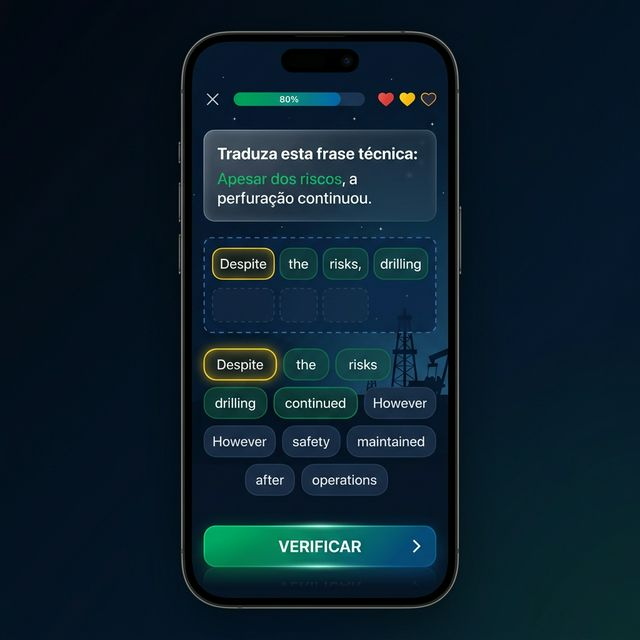

# 🚀 Plano de Implementação: Petro-Lingo Sentence Builder (Premium)

Este plano detalha a criação da funcionalidade **"Petro-Lingo"**, um clone do sistema de construção de frases do Duolingo, focado especificamente em passar no concurso da Petrobras (banca Cesgranrio).

---

## 🎨 Visual Mockup (Mobile-First)

Abaixo está o conceito visual da interface para dispositivos móveis, focando em uma experiência de "aplicativo nativo" dentro da plataforma web.



### Racional do Design:
- **Header "App-Like"**: Barra de progresso slim e ícones de "Vidas" (corações) no topo.
- **Área de Atividade**: Texto em português (origem) claro e legível, com slots vazios esperando as palavras.
- **Pool de Palavras**: Botões arredondados com sombras suaves (efeito 3D) para incentivar o toque.
- **Cores**: Paleta baseada na identidade da Petrobras (Azul Profundo, Verde Esmeralda e acentos Amarelo-Vibrante) com Dark Mode para reduzir a fadiga ocular.

---

## 🛠️ Arquitetura Técnica

Para garantir que a experiência seja fluida ("smooth"), utilizaremos as seguintes tecnologias:

### 1. Componentes & Estado
- **`PetroLingoExercise.tsx`**: Componente principal que gerencia o fluxo (Questão -> Pool -> Verificação).
- **Gerenciamento de Estado**: 
  - `shuffledWords`: Array de strings embaralhadas.
  - `selectedWords`: Array de strings que o usuário clicou.
  - `status`: 'idle' | 'checking' | 'correct' | 'incorrect'.

### 2. Animações (Framer Motion)
Para o sentimento de "app", usaremos:
- **`layoutId`**: Permite que a palavra "voe" suavemente do pool para o slot de destino.
- **`AnimatePresence`**: Para transições suaves entre diferentes questões.
- **Haptic Feedback Simulation**: Vibrações visuais (shake) no erro.

### 3. Exemplo de Lógica de Sentença
```typescript
{
  portuguese: "Apesar dos riscos, a perfuração continuou.",
  english: ["Despite", "the", "risks", "drilling", "continued"],
  category: "Conectores/HSE",
  explanation: "O conector 'Despite' (apesar de) é seguido diretamente por um substantivo ou gerúndio."
}
```

---

## 🛤️ Roadmap de Desenvolvimento

### Fase 1: Fundação do Componente
- Criar a estrutura responsiva (Mobile/Desktop).
- Implementar a lógica de clique: Clicar no pool movimenta para o slot; clicar no slot devolve para o pool.

### Fase 2: Polimento Gamificado
- Adicionar sons de acerto/erro (opcional, mas recomendado para Premium).
- Implementar a barra de progresso dinâmica.
- Sistema de feedback pós-resposta (explicação gramatical).

### Fase 3: Integração Premium
- Linkar o componente ao sistema de planos (somente disponível para usuários Premium).
- Criar o banco de dados de sentenças baseadas na Cesgranrio (Reading Strategies, Technical Vocabulary).

---

## 💡 Valor para o Aluno
Diferente de uma aula passiva, o **Petro-Lingo** treina a leitura ativa. Ao reconstruir uma frase com "Despite" ou "However", o aluno para de apenas "ver" a palavra e passa a entender sua **função sintática**, o que é a chave para matar 90% das questões de conectores da banca.

---

> [!TIP]
> **Mobile Optimization**: No CSS, usaremos `touch-action: manipulation` para evitar o delay de clique de 300ms nos celulares e garantir que os botões tenham pelo menos 44px de altura para acessibilidade.

O que você acha dessa abordagem? Se estiver de acordo, posso começar a criar o arquivo base `src/components/aulas/ingles/PetroLingoExercise.tsx`.
