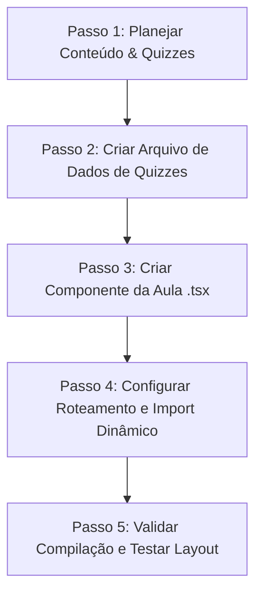

# Skill: Criar Aula Premium (Super Skill Integrada)

> **PROPÓSITO:** Garantir que todas as aulas criadas nasçam 100% livres de erros de compilação, usem a nomenclatura mais recente do design system e apresentem alto nível de densidade pedagógica para concursos públicos.

---

## 📐 1. CONFORMIDADE COM O DESIGN SYSTEM (REGRAS EXCLUSIVAS)

### A. Introdução de Módulo (INTRO)
* Toda introdução de módulo deve usar a propriedade `index="INTRO"` no componente `ModuleSectionHeader`.
* O conteúdo deve obrigatoriamente possuir **exatamente 5 parágrafos** estruturados no mnemônico **C.E.D.E.A**:
  1. **Contexto**: Relação do assunto com editais e banca.
  2. **Explicação**: Regra técnica formal detalhada.
  3. **Demonstração**: Sentenças práticas de aplicação (ex: Certo vs. Errado).
  4. **Expansão**: Casos raros, exceções latentes e discussões avançadas.
  5. **Aplicação**: Foco na banca CESGRANRIO (pegadinhas comuns).

### B. FlipCards Premium (Lucide)
* **Proibido** usar emojis comuns no visual dos cards. Use componentes Lucide correspondentes ao tema.
* Toda a anatomia do FlipCard deve seguir as especificações de cores semânticas e o header bar no verso contendo `LuCheck` (ver em `docs/GUIA_CRIACAO_AULAS.md`).
* Os grids de FlipCards devem usar exclusivamente `gap-6` para consistência em visualizações responsivas.

### C. Mesa de Consolidação (`ModuleConsolidation`)
* **Proibido** o uso da propriedade antiga `maceteVisual`. Use exclusivamente a chave de propriedade `sinteseEstrategica`.
* Preencha os nós de vídeo (ID do YouTube) e de áudio de forma consistente. Se o áudio não estiver gravado, aponte para um link placeholder (`/audios/placeholder.mp3`), mas declare a interface.

---

## 🛠️ 2. FLUXO DE DESENVOLVIMENTO DE AULA

Ao criar ou atualizar qualquer aula, o agente deve seguir o checklist de 5 passos abaixo:

### Passo 1: Planejar Conteúdo & Quizzes
* Divida a matéria em exatamente **10 módulos**.
* Defina as questões focadas no padrão CESGRANRIO para o arquivo de quizzes.

### Passo 2: Criar Arquivo de Quizzes
* Salve os quizzes em `src/components/aulas/[materia]/data/[topico]-quizzes.ts`.
* Cada módulo deve ter no mínimo 1 quiz contendo de 1 a 5 questões de múltipla escolha.

### Passo 3: Criar Componente da Aula
* Crie o arquivo `src/components/aulas/[materia]/Aula[Nome].tsx`.
* Use o template boilerplate que está documentado no guia `docs/GUIA_CRIACAO_AULAS.md`.
* Garanta a importação correta de tipos como `AulaProps` e `QuizQuestion` de `../shared`.

### Passo 4: Configurar Roteamento
* Registre no `src/data/conteudo.ts`.
* Adicione o import dinâmico (`dynamic`) e a renderização condicional em `src/app/(dashboard)/aulas/[materia]/[topico]/page.tsx` para evitar que a aula apareça como "Em desenvolvimento".

### Passo 5: Validar Compilação
* Execute `tsc --noEmit` no terminal para verificar se há erros de digitação, imports quebrados ou falta de propriedades.

---

## 🔍 3. SCRIPT DE DETECÇÃO E AUDITORIA DE CÓDIGO (ANTI-PATTERNS)

A skill atua de forma preventiva antes de entregar a tarefa. Toda aula deve ser auditada para assegurar que:
1. **Nenhum** import de `shared` venha de subpastas fora do escopo (ex: use `from "../shared"` e nunca `from "./shared"` ou referências absolutas incorretas).
2. Não haja strings órfãs fora de elementos de texto ou de parágrafos.
3. Não sejam detectados termos como `maceteVisual` que possam quebrar a compilação do bundle de produção do Next.js.
