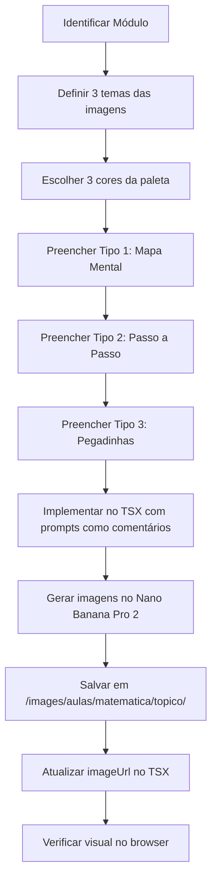

# Skill: Matemática Visual Builder

> **PROPÓSITO:** Padronizar a criação de imagens educacionais 9:16 (retrato) para as aulas de
> Matemática do Petrobras Quest — no estilo "Mapas de Concurseira": colorido, manuscrito/orgânico,
> fundo branco/creme, setas e balões, nunca dark ou cyberpunk.

---

## 🎨 IDENTIDADE VISUAL OBRIGATÓRIA (Estilo Mapa de Concurseira)

### Referência Visual
As imagens devem imitar fielmente o estilo das fotos de referência fornecidas pelo usuário:
- **Fundo:** branco ou creme claro (`#FFFDF4` ou branco puro)
- **Tipografia:** misto de caixa alta caps e cursiva manuscrita para títulos e destaques
- **Cores:** paleta vibrante e analógica — use apenas 3 a 4 cores por imagem:
  - Rosa / magenta (`#E91E8C` ou similar)
  - Teal / verde-água (`#00897B` ou similar)
  - Laranja / âmbar (`#FF8F00` ou similar)
  - Roxo claro / lilás (`#9C27B0` light variant)
  - Verde médio (`#43A047`)
  - Nunca misture mais de 4 cores numa imagem
- **Elementos gráficos:** setas curvas à mão, balões de destaque, caixas com bordas simples, ícones
  simples de emoji integrado ao desenho (⚠️ só na prop `sinteseEstrategica`), linhas orgânicas
- **Fórmulas:** escritas em fonte semi-cursiva com destaque de cor; não use LaTeX renderizado
- **Layout:** mind-map centralizado OU diagrama de fluxo vertical com título no centro ou no topo

### O que NUNCA FAZER
- ❌ Fundo escuro, gradiente escuro, modo dark
- ❌ Estilo cyberpunk, neon, HUD
- ❌ Estética de terminal ou código
- ❌ Muitas cores (mais de 4 por imagem)
- ❌ Elementos 3D realistas
- ❌ Fotos ou mockups de pessoa

---

## 📐 FORMATO DAS IMAGENS

| Propriedade | Valor |
|-------------|-------|
| Proporção   | **9:16 (retrato)** — Portrait |
| Resolução   | 1080 × 1920 px (ou mínimo 720 × 1280 px) |
| Formato     | PNG ou JPG |
| Fundo       | Branco ou creme `#FFFDF4` |

> ⚠️ **O componente `ModuleSummaryCarouselNew` usa `aspect-[3/4]` no carrossel.**
> Imagens 9:16 serão exibidas com `object-cover` centrado (topo e base cortados).
> Planeje o conteúdo principal na faixa central da imagem (dos 10% ao 90% da altura).

---

## 🖼️ PADRÃO: 3 IMAGENS POR MÓDULO

Cada módulo de matemática deve ter **exatamente 3 imagens** no `ModuleSummaryCarouselNew`:

| Nº | Tipo | Conteúdo |
|----|------|----------|
| 1 | **Mapa Mental** | Conceito central no meio, ramos para definição, símbolos, propriedades |
| 2 | **Esquema Passo-a-Passo** | Fluxo vertical ou diagrama com fórmula principal + exemplo resolvido |
| 3 | **Pegadinhas & Dicas** | Comparativo ✅ vs ❌, alertas de banca, macete visual |

---

## 🤖 TEMPLATE DE PROMPT — NANO BANANA PRO 2

### Estrutura do Prompt (copie e adapte)

```
[NANO BANANA PRO 2 - MATH VISUAL 9:16]

STYLE MANDATE:
- Format: Portrait 9:16, white/cream background (#FFFDF4)
- Art style: hand-drawn mind map / educational infographic, "concurseira" notebook style
- Feel: friendly, colorful, organic — like a student's annotated notes
- Typography: mix of bold caps headers + handwriting-style cursive for labels
- Colors: use ONLY [COLOR_1], [COLOR_2], [COLOR_3] from the math palette below
- NO dark backgrounds, NO neon, NO cyberpunk, NO 3D rendering

MATH COLOR PALETTE (pick 3 per image):
  Pink/magenta: #E91E8C | Teal: #00897B | Amber: #FF8F00
  Purple: #7B1FA2 | Green: #43A047 | Blue: #1565C0

CONTENT:
[DESCREVA O CONTEÚDO MATEMÁTICO AQUI — fórmulas, conceitos, exemplos]

LAYOUT:
[ESCOLHA: mind-map-central | flow-top-to-bottom | comparison-grid | formula-spotlight]

MANDATORY ELEMENTS:
- Main title in large bold text at the [top | center]: "[TÍTULO DA IMAGEM]"
- Subject tag bottom-right corner: "MATEMÁTICA • PETROBRAS"
- Keep all key content in center 80% of height (safe zone for cropping)
```

---

## 🗂️ PROMPTS PRONTOS POR TIPO DE IMAGEM

### Tipo 1 — Mapa Mental (Conceito Central)

```
[NANO BANANA PRO 2 - MATH VISUAL 9:16]

STYLE MANDATE:
- Format: Portrait 9:16, white background
- Art style: mind map with hand-drawn connectors, "concurseira" notebook aesthetic
- Colors: [COR_PRINCIPAL], [COR_SECUNDÁRIA], [COR_TERCIÁRIA]
- NO dark backgrounds, NO cyberpunk

CONTENT:
Central node (large, rounded box with main color): "[NOME DO TÓPICO]"
Branches radiating outward with curved arrows:
  Branch 1 → "[Definição / Conceito]": [TEXTO CURTO]
  Branch 2 → "[Fórmula Principal]": [FÓRMULA EM DESTAQUE]
  Branch 3 → "[Exemplo]": [EXEMPLO NUMÉRICO]
  Branch 4 → "[Propriedade / Regra]": [TEXTO CURTO]
  Branch 5 → "[Contextualização]": [TEXTO CURTO]

LAYOUT: mind-map-central
Curved arrow connectors, small emoji icons at branch nodes
Main title: "[NOME DO TÓPICO]" — centered, large, bold caps

MANDATORY ELEMENTS:
- Subject tag bottom-right: "MATEMÁTICA • PETROBRAS"
- Safe zone: keep all content between 10% and 90% of image height
```

### Tipo 2 — Esquema Passo-a-Passo (Fórmula + Resolução)

```
[NANO BANANA PRO 2 - MATH VISUAL 9:16]

STYLE MANDATE:
- Format: Portrait 9:16, cream white background (#FFFDF4)
- Art style: vertical flow diagram, educational notebook style
- Colors: [COR_PRINCIPAL], [COR_SECUNDÁRIA]
- Clean sans-serif for formulas, cursive for labels

CONTENT:
TOP SECTION — Title box with [COR_PRINCIPAL]:
  Title: "[NOME DO ESQUEMA]"

MIDDLE SECTION — Step-by-step flow (top to bottom, connected by down arrows ↓):
  Step 1: "[Nome do Passo]" → [Descrição breve] → [Fórmula/Valor]
  Step 2: "[Nome do Passo]" → [Descrição breve] → [Fórmula/Valor]
  Step 3: "[Nome do Passo]" → [Descrição breve] → [Fórmula/Valor]

HIGHLIGHT BOX (center, [COR_SECUNDÁRIA] border):
  "[FÓRMULA PRINCIPAL DESTACADA]"

BOTTOM SECTION — Worked example:
  "Exemplo: [ENUNCIADO CURTO]"
  "[RESOLUÇÃO PASSO A PASSO]"
  Result in large bold: "[RESPOSTA]"

LAYOUT: flow-top-to-bottom
MANDATORY ELEMENTS:
- Subject tag bottom-right: "MATEMÁTICA • PETROBRAS"
```

### Tipo 3 — Pegadinhas & Dicas (Comparativo Banca)

```
[NANO BANANA PRO 2 - MATH VISUAL 9:16]

STYLE MANDATE:
- Format: Portrait 9:16, white background
- Art style: comparison chart, "concurseira" warning-style
- Colors: teal #00897B (correct), rose-red #E53935 (wrong), amber #FF8F00 (warning)
- Bold warning signs, checkmarks and X marks

CONTENT:
TOP — Title in bold caps: "⚠️ PEGADINHAS — [NOME DO TÓPICO]"

SECTION 1 — Comparison grid (2 columns):
  ✅ CORRETO               ❌ ERRADO
  "[Exemplo Certo]"        "[Exemplo Errado]"
  "[Exemplo Certo 2]"      "[Exemplo Errado 2]"

SECTION 2 — Warning box (amber border, large):
  "⚠️ ATENÇÃO CESGRANRIO"
  "[Descrição da pegadinha principal]"

SECTION 3 — Golden tip box (teal background, white text):
  "💡 MACETE"
  "[Macete ou atalho mental para lembrar]"

LAYOUT: comparison-grid
MANDATORY ELEMENTS:
- Subject tag bottom-right: "MATEMÁTICA • PETROBRAS"
- Warning triangle icon (⚠️) visible at top
```

---

## 💻 IMPLEMENTAÇÃO NO CÓDIGO TSX

### Padrão de Uso no `ModuleSummaryCarouselNew`

```tsx
<ModuleSummaryCarouselNew
  images={[
    {
      title: "[Título Descritivo do Conceito]",
      type: "Mapa Mental",
      placeholderColor: "bg-[COR]-100 dark:bg-[COR]-900/30",
      // PROMPT NANO BANANA PRO 2:
      // [Cole aqui o prompt do Tipo 1 preenchido]
      // imageUrl: "/images/aulas/matematica/[topico]/m[N]-conceito.png",
    },
    {
      title: "[Fórmula + Exemplo Resolvido]",
      type: "Passo a Passo",
      placeholderColor: "bg-[COR]-100 dark:bg-[COR]-900/30",
      // PROMPT NANO BANANA PRO 2:
      // [Cole aqui o prompt do Tipo 2 preenchido]
      // imageUrl: "/images/aulas/matematica/[topico]/m[N]-formula.png",
    },
    {
      title: "[Nome das Pegadinhas e Dicas]",
      type: "Dicas CESGRANRIO",
      placeholderColor: "bg-amber-100 dark:bg-amber-900/30",
      // PROMPT NANO BANANA PRO 2:
      // [Cole aqui o prompt do Tipo 3 preenchido]
      // imageUrl: "/images/aulas/matematica/[topico]/m[N]-dicas.png",
    },
  ]}
  moduloNome="[Nome do Módulo]"
  tituloAula="[Nome da Aula]"
  materia="Matemática"
/>
```

> **Regra de Nomeação de Arquivo:**
> `/images/aulas/matematica/[topico-kebab-case]/m[numero]-[tipo].png`
> Exemplos: `/images/aulas/matematica/conjuntos/m1-conceito.png`, `m1-formula.png`, `m1-dicas.png`

---

## 🖼️ RICH INTRO VISUAL — UPGRADE DE MATEMÁTICA

> **CONTEXTO:** As Rich Intros de matemática são atualmente de texto denso (C.E.D.E.A).
> Em matemática, elementos visuais (fórmulas, diagramas, tabelas) são ESSENCIAIS.
> Esta seção define como enriquecer as Rich Intros com visuais sem remover o texto.

### Estrutura da Rich Intro Visual de Matemática

```tsx
{/* ═══ RICH INTRO SECTION M[N] ═══ */}
<section className="bg-card rounded-2xl border border-border p-8 md:p-10 shadow-sm space-y-8">
  <ModuleSectionHeader
    index="INTRO"
    title="[Título Descritivo]"
    description="[Subtitle da seção]"
    variant={mv[N]}
  />

  {/* BLOCO 1: Visual Hero — Imagem 9:16 + Texto Lateral */}
  <div className="grid grid-cols-1 md:grid-cols-2 gap-8 items-start">
    {/* Imagem visual do conceito (9:16 → exibida como 3:4 com object-cover) */}
    <div className="aspect-[3/4] rounded-2xl overflow-hidden border border-border/50 shadow-sm bg-[COR]-50 dark:bg-[COR]-900/20">
      {/* PROMPT NANO BANANA: [Mapa mental do conceito principal - Tipo 1] */}
      {/* imageUrl PLACEHOLDER — substituir após geração */}
      
    </div>

    {/* Texto C.E.D.E.A — Contexto + Explicação */}
    <div className="space-y-6 text-lg text-foreground/85 leading-relaxed text-justify">
      <p>
        [Parágrafo 1 — C]
      </p>
      <p>
        [Parágrafo 2 — C continuação]
      </p>
      <p>
        [Parágrafo 3 — E]
      </p>
      <p>
        [Parágrafo 4 — E continuação]
      </p>
    </div>
  </div>

  {/* BLOCO 2: Fórmula Destacada */}
  <div className="bg-gradient-to-br from-[COR]-50 to-[COR]-100 dark:from-[COR]-950/30 dark:to-[COR]-900/20 rounded-xl border border-[COR]-200 dark:border-[COR]-800 p-6 text-center">
    <p className="text-xs font-bold uppercase tracking-widest text-[COR]-600 dark:text-[COR]-400 mb-3">
      Fórmula-Chave
    </p>
    <p className="font-mono text-2xl md:text-3xl font-black text-foreground">
      [FÓRMULA PRINCIPAL]
    </p>
    <p className="text-sm text-muted-foreground mt-2">[Legenda da fórmula]</p>
  </div>

  {/* BLOCO 3: Texto Demonstração + Expansão + Aplicação */}
  <div className="space-y-6 text-lg text-foreground/85 leading-relaxed text-justify">
    <p>
      [Parágrafo 5 — D]
    </p>
    <p>
      [Parágrafo 6 — D continuação com exemplo]
    </p>
    <p>
      [Parágrafo 7 — E2]
    </p>
    <p>
      [Parágrafo 8 — E2 continuação]
    </p>
    <p>
      [Parágrafo 9 — A]
    </p>
    <p>
      [Parágrafo 10 — A continuação / dica CESGRANRIO]
    </p>
  </div>
</section>
```

---

## 📋 CHECKLIST DE MÓDULO VISUAL DE MATEMÁTICA

Antes de marcar um módulo como "visual completo":

- [ ] `ModuleSummaryCarouselNew` tem **exatamente 3 imagens** configuradas
- [ ] Cada imagem tem `title`, `type` e `placeholderColor` preenchidos
- [ ] Cada imagem tem o **prompt completo** documentado no comentário `// PROMPT NANO BANANA PRO 2:`
- [ ] O `imageUrl` está no formato `/images/aulas/matematica/[topico]/m[N]-[tipo].png`
- [ ] Imagens geradas são **9:16** (retrato), fundo branco/creme, estilo colorido
- [ ] A Rich Intro do módulo tem o **bloco visual hero** (imagem lateral + texto)
- [ ] A Rich Intro tem o **bloco de fórmula destacada** com fonte mono grande
- [ ] A Rich Intro mantém os **10 parágrafos C.E.D.E.A**
- [ ] Nenhuma imagem usa tema dark, cyberpunk ou fundo escuro

---

## 🔄 FLUXO DE TRABALHO COMPLETO



---

## 📌 EXEMPLO COMPLETO — AULA DE CONJUNTOS (Módulo 1)

### Prompts Gerados

**Imagem 1 — Mapa Mental (Tipo 1):**
```
[NANO BANANA PRO 2 - MATH VISUAL 9:16]
STYLE: Portrait 9:16, white background, mind map concurseira style
COLORS: teal #00897B, pink #E91E8C, amber #FF8F00
NO dark backgrounds.

CONTENT:
Central node (teal): "CONJUNTOS"
Branch 1 → "Definição": Coleção bem definida de objetos
Branch 2 → "Notação": A = {a, e, i, o, u} | x ∈ A | x ∉ A
Branch 3 → "Representação": Por extensão | Por compreensão | Venn
Branch 4 → "Cardinalidade": n(A) = número de elementos distintos
Branch 5 → "Conjunto Vazio": ∅ ⊂ A para todo A

LAYOUT: mind-map-central, curved hand-drawn arrows
Title: "CONJUNTOS" — center, large bold caps in teal
Subject tag bottom-right: "MATEMÁTICA • PETROBRAS"
```

**Imagem 2 — Passo a Passo (Tipo 2):**
```
[NANO BANANA PRO 2 - MATH VISUAL 9:16]
STYLE: Portrait 9:16, cream background #FFFDF4, vertical flow diagram
COLORS: pink #E91E8C, teal #00897B
NO dark backgrounds.

CONTENT:
TOP TITLE (pink box): "RELAÇÕES ENTRE CONJUNTOS"

FLOW (top to bottom with arrows ↓):
  Box 1 (teal border): "PERTINÊNCIA ∈ / ∉" → Elemento ↔ Conjunto
  Box 2 (pink border): "INCLUSÃO ⊂ / ⊄" → Conjunto ↔ Conjunto
  Box 3 (amber): "IGUALDADE A = B" → Mesmos elementos

HIGHLIGHT (center, pink): "∅ ⊂ A — Vazio pertence a TODOS"

WORKED EXAMPLE:
  "Se A = {1,2,3}:"
  "  1 ∈ A ✅   {1} ∈ A ❌   {1} ⊂ A ✅"

Subject tag bottom-right: "MATEMÁTICA • PETROBRAS"
```

**Imagem 3 — Pegadinhas (Tipo 3):**
```
[NANO BANANA PRO 2 - MATH VISUAL 9:16]
STYLE: Portrait 9:16, white background, comparison warning chart
COLORS: teal (correct), red #E53935 (wrong), amber (warning)
NO dark backgrounds.

CONTENT:
TOP TITLE (bold caps): "⚠️ PEGADINHAS — CONJUNTOS"

COMPARISON GRID:
  ✅ CORRETO               ❌ ERRADO
  "1 ∈ {1,2,3}"           "{1} ∈ {1,2,3}"
  "{1} ⊂ {1,2,3}"         "1 ⊂ {1,2,3}"
  "∅ ⊂ A (sempre!)"       "∅ ∈ A (nem sempre)"
  "{∅} ≠ ∅"               "Confundir {∅} com ∅"

WARNING BOX (amber): "⚠️ ∈ é para ELEMENTO | ⊂ é para CONJUNTO"

TIP BOX (teal, white text): "💡 MACETE: Se tem chaves dos dois lados → ⊂ (inclusão)"

Subject tag bottom-right: "MATEMÁTICA • PETROBRAS"
```

### Implementação TSX Resultante

```tsx
<ModuleSummaryCarouselNew
  images={[
    {
      title: "Mapa de Conjuntos — Conceitos Fundamentais",
      type: "Mapa Mental",
      placeholderColor: "bg-teal-100 dark:bg-teal-900/30",
      // PROMPT NANO BANANA PRO 2: [ver prompts acima - Imagem 1]
      imageUrl: "/images/aulas/matematica/conjuntos/m1-conceito.png",
    },
    {
      title: "Relações: Pertinência, Inclusão e Igualdade",
      type: "Passo a Passo",
      placeholderColor: "bg-pink-100 dark:bg-pink-900/30",
      // PROMPT NANO BANANA PRO 2: [ver prompts acima - Imagem 2]
      imageUrl: "/images/aulas/matematica/conjuntos/m1-formula.png",
    },
    {
      title: "Pegadinhas CESGRANRIO — ∈ vs ⊂",
      type: "Dicas CESGRANRIO",
      placeholderColor: "bg-amber-100 dark:bg-amber-900/30",
      // PROMPT NANO BANANA PRO 2: [ver prompts acima - Imagem 3]
      imageUrl: "/images/aulas/matematica/conjuntos/m1-dicas.png",
    },
  ]}
  moduloNome="Módulo 1 — Fundamentos de Conjuntos"
  tituloAula="Conjuntos"
  materia="Matemática"
/>
```

---

## ⚙️ ESCOPO DE APLICAÇÃO

Esta skill aplica-se a:
- `src/components/aulas/matematica/Aula*.tsx` — todos os módulos
- Futuramente: `src/components/aulas/raciocinio-logico/Aula*.tsx`

**Limitações:**
- Esta skill padroniza o visual — não valida a precisão pedagógica do conteúdo matemático.
- Sempre execute `tsc --noEmit` após adicionar `imageUrl` para garantir que não há erros de tipo.
- A geração de imagens deve ser feita manualmente no Nano Banana Pro 2 usando os prompts desta skill.
