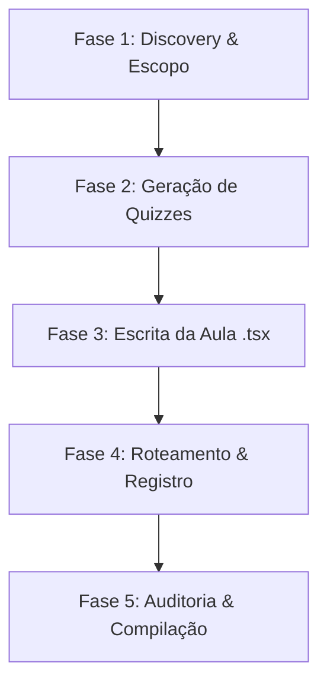

# 🌊 Workflow: Criar Aula Premium

Este workflow define as etapas operacionais que o agente de desenvolvimento deve seguir ao criar ou atualizar uma aula no repositório. Ele guia a coleta de requisitos didáticos e garante o correto registro de arquivos no ecossistema Next.js.

---

## 🧭 FASES DO WORKFLOW



---

### 🔍 Fase 1: Discovery & Escopo

Nesta fase, o desenvolvedor ou o agente deve alinhar com o usuário as informações da aula:

1. **Tema da Aula** (ex: Concordância Verbal, Teoria de Conjuntos).
2. **Matéria pertencente** (ex: Português, Matemática, Informática).
3. **Profissão de Foco da Petrobras** (ex: Técnico de Operação, Técnico de Logística) para orientar os exemplos práticos e industriais.
4. **Subtópicos dos 10 Módulos** obrigatórios.

### 📝 Fase 2: Geração de Quizzes

Antes de programar o front-end, crie o arquivo de dados dos quizzes:

1. Crie o arquivo `src/components/aulas/[materia]/data/[topico]-quizzes.ts`.
2. Escreva as questões de múltipla escolha focadas na banca **CESGRANRIO** com contextualização industrial na refinaria, plataforma ou logística da Petrobras.
3. Certifique-se de que a tipagem segue a interface `QuizQuestion[]`.

### 💻 Fase 3: Escrita da Aula (.tsx)

1. Crie a aula em `src/components/aulas/[materia]/Aula[Nome].tsx` utilizando o boilerplate e as cores recomendadas de `docs/GUIA_CRIACAO_AULAS.md`.
2. **Valide a estrutura didática**:
   - Cada módulo inicia com `ModuleBanner`.
   - Seção de Introdução com `ModuleSectionHeader index="INTRO"` e 5 parágrafos densos (C.E.D.E.A).
   - Seções teóricas com acordeão e FlipCards premium contendo ícones Lucide.
   - Encerramento do módulo com `ModuleConsolidation` contendo obrigatoriamente a propriedade `sinteseEstrategica` (Macete Visual).
   - **Dica Criativa**: Na `sinteseEstrategica`, o uso de emojis grandes e animações é incentivado para criar âncoras visuais.
   - Quiz final do módulo amarrado com o pool correspondente.

### 🔗 Fase 4: Roteamento & Registro

1. Registre os metadados da aula no arquivo `src/data/conteudo.ts` sob a matéria e tópico desejados.
2. Integre o componente de aula no arquivo `src/app/(dashboard)/aulas/[materia]/[topico]/page.tsx` usando imports dinâmicos (`dynamic` do Next.js) e renderização condicional.

### 🔬 Fase 5: Auditoria & Compilação

1. **Compilação Estática**:
   No terminal, execute o comando de verificação de tipos:
   ```bash
   pnpm tsc --noEmit
   ```
   _Qualquer erro de tipo TypeScript deve ser corrigido antes do commit._
2. **Teste em Desenvolvimento**:
   Inicie o servidor local:
   ```bash
   pnpm dev
   ```
   Acesse a URL da aula no navegador local e verifique a responsividade em telas mobile e desktop.
